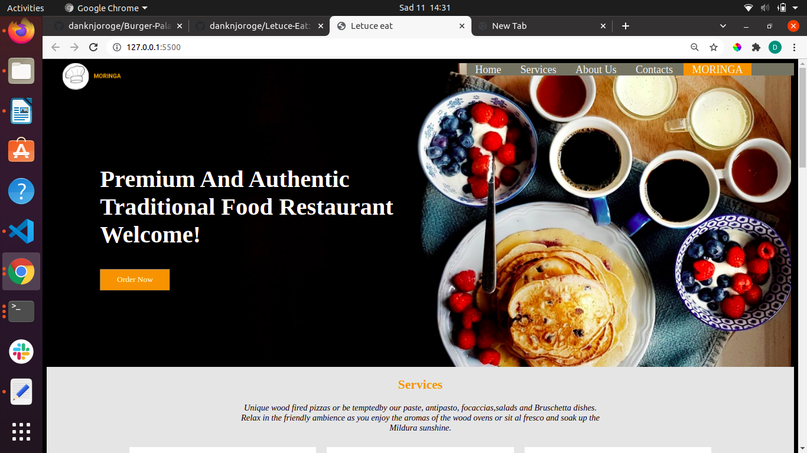
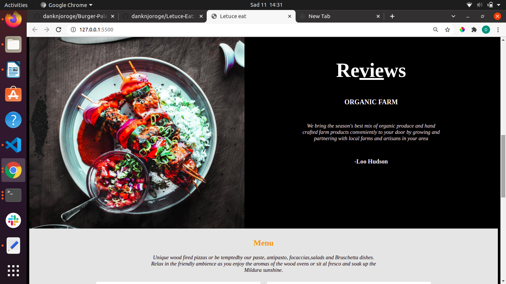

## Letuce Eat
#### Daniel Njoroge
## Description
This is a simple landing page for Letuce Eat website.

## Screenshot

## Setup/Installation Requirements
* Clone the repository to your computer from 
        https://github.com/danknjoroge/Letuce-Eat.git
* Open the project using your preferred code editor, preferably Visual studio Code.
* Open the project using a web browser, preferably Google Chrome.
## Known Bugs
There are no known bugs
## Technologies Used
HTML 
CSS
## Support and contact details
for any query or support reach me through.
* dank8505@gmail.com
## License
This project is under [MIT](LICENSE).
### Collaborators
Daniel Njoroge
